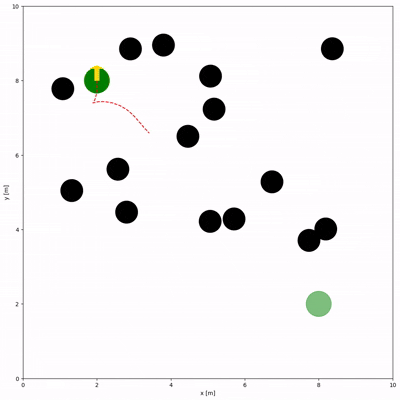

# Minimal_TEB

</a>
<a href="https://github.com/hanruihua/ir-sim"></a>
<a href="https://github.com/casadi"></a>

Simplified TEB algorithm based on ir sim.


# How to use

```shell
conda create --name Mte python=3.9
conda activate Mte
pip install -r requirements.txt
python run.py
```

# DEMO


